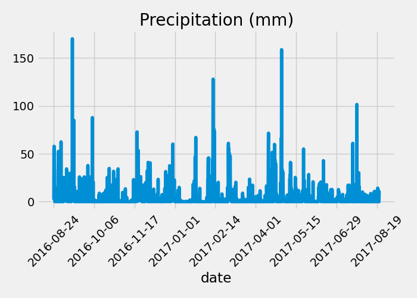

## sqlalchemy_challenge
Congratulations! You've decided to treat yourself to a long holiday vacation in Honolulu, Hawaii. To help with your trip planning, you decide to do a climate analysis about the area. The following sections outline the steps that you need to take to accomplish this task.

### Part 1: Analyse and Explore the Climate Data
In this section, you’ll use Python and SQLAlchemy to do a basic climate analysis and data exploration of your climate database. Specifically, you’ll use SQLAlchemy ORM queries, Pandas, and Matplotlib. To do so, complete the following steps:
- Note that you’ll use the provided files (climate_starter.ipynb and hawaii.sqlite) to complete your climate analysis and data exploration.
- Use the SQLAlchemy create_engine() function to connect to your SQLite database.
- Use the SQLAlchemy automap_base() function to reflect your tables into classes, and then save references to the classes named station and measurement.
- Link Python to the database by creating a SQLAlchemy session.
- Perform a precipitation analysis and then a station analysis by completing the steps in the following two subsections.

#### Precipitation Analysis
- Find the most recent date in the dataset.
- Using that date, get the previous 12 months of precipitation data by querying the previous 12 months of data.
- Select only the "date" and "prcp" values.
- Load the query results into a Pandas DataFrame. Explicitly set the column names.
- Sort the DataFrame values by "date".
- Please find the results below:
  
  
